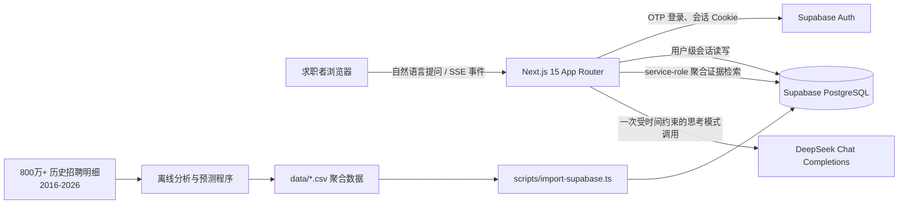
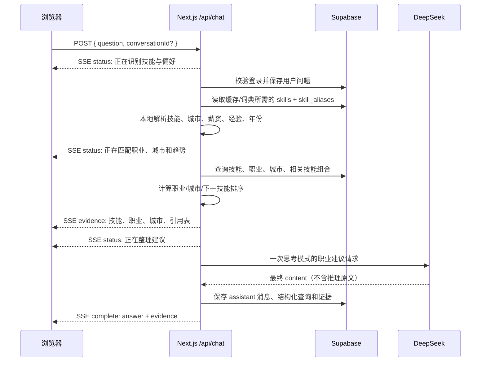

# 职向量项目架构与数据流说明

## 1. 项目目标

职向量是一个面向求职者的职业决策问答应用。用户以自然语言描述已掌握的技能、专业知识、工作经验、期望薪资、理想城市和关注年份；系统依据已入库的上市公司历史招聘聚合数据，给出可追溯的职业方向、城市选择、技能补强和趋势建议。

项目的核心原则如下：

- **事实优先**：模型不能凭空生成就业市场数据，所有建议必须来自 Supabase 中已入库的招聘聚合证据。
- **结论优先**：用户要的是“下一步怎么选”，而不是字段、分数和原始 JSON 的复述。
- **组合边界明确**：只有数据库中直接观测到的技能组合，才使用组合职业证据；没有直接观测时，不推断工资互补效应或组合前景。
- **低延迟可感知**：用户在等待最终文字建议时，先看到系统已检索到哪些技能、职业、城市和数据来源表。
- **一分钟内可用回答**：模型响应慢或失败时，系统使用相同证据生成本地自然语言建议，避免请求一直停留在加载状态。

> 说明：800 多万条原始招聘记录用于离线清洗、职业映射、技能抽取、预测和 AI 渗透率计算。线上应用不直接扫描这 800 万条明细，而是查询其派生出的技能、职业、城市和趋势聚合数据。

## 2. 总体架构



### 2.1 分层职责

| 层 | 主要组件 | 职责 |
|---|---|---|
| 展示层 | `components/career-workbench.tsx`、`components/feedback-panel.tsx` | 登录、提问、读取流式事件、显示引用证据和最终建议、展示历史会话与问题反馈。 |
| Web 服务层 | `app/api/chat/route.ts` | 校验请求和登录状态、管理会话、组织解析/检索/生成步骤、输出 SSE。 |
| 本地理解层 | `lib/local-query.ts` | 不调用大模型，直接从问题中提取标准技能、城市、薪资、经验、学历、年份和咨询意图。 |
| 证据层 | `lib/evidence.ts`、`lib/ranking.ts` | 从 Supabase 检索真实指标，计算职业、城市、下一技能和偏好说明。 |
| 生成层 | `lib/deepseek.ts` | 使用一个受限的 DeepSeek 调用，将事实证据组织成简洁、自然的职业建议。 |
| 可靠性层 | `lib/career-presentation.ts`、`lib/chat-stream.ts` | 生成证据预览、SSE 编解码、模型超时后的本地回答。 |
| 数据层 | Supabase PostgreSQL + Auth | 保存业务聚合数据、用户会话和消息；提供 Email OTP 身份认证。 |
| 通知层 | Resend + `app/api/feedback/route.ts` | 仅由服务端发送已登录用户的问题反馈，不把邮件密钥发到浏览器。 |

## 3. 离线数据流：从招聘明细到 Supabase

### 3.1 数据处理边界

离线分析阶段负责较重的计算，包括：

1. 将岗位映射到《职业大典》的职业小类。
2. 从岗位文本抽取技术技能、专业知识和非技术能力。
3. 统计技能需求、薪资、经验、学历与城市分布，并生成 2026-2028 年预测。
4. 计算技能共现、直接组合证据、工资互补检验和 AI 渗透率。
5. 将结果导出为 `data/` 下的 CSV 聚合文件。

线上系统只处理已经聚合的数据，因此网页查询量与原始招聘明细规模解耦。

### 3.2 导入过程

导入命令为：

```bash
npm run import:data
```

导入程序位于 `scripts/import-supabase.ts`，使用 Supabase service-role 密钥，每批最多写入 500 行。它会：

- 读取 `skills_full.csv`，建立技能主表与预测 JSON。
- 用 `skill_aliases.csv` 建立别名到标准技能名称的映射。
- 规范化技能名称与技能对顺序，避免同一组合重复。
- 分别写入职业、城市、技能组合、年度/月度趋势、AI 暴露度、培养方案和职业大典明细。
- 支持按 `--section skills|aliases|relations|curriculum|supplemental` 分段重跑。

Vercel 线上函数仅携带 AI 共现、培养方案、专业技能映射和职业大典四个轻量 CSV，作为可选 Supabase 表尚未导入时的兜底；其余离线数据仍由 `.vercelignore` 排除。

## 4. Supabase 表与当前用途

| 表 | 来源 CSV | 内容 | 在线问答用途 |
|---|---|---|---|
| `skills` | `skills_full.csv` | 每项标准技能的需求、薪资、经验、学历、AI 指标和 2026-2028 预测。 | 技能画像与趋势事实。 |
| `skill_aliases` | `skill_aliases.csv` | 用户写法、同义词到标准技能的映射。 | 本地解析词典的来源。 |
| `skill_pairs` | `skill_pairs.csv` | 技能两两共现、NPMI、互补效应、组合需求趋势。 | 直接组合判断与下一技能推荐。 |
| `occupation_skill_stats` | `occupation_skill_stats.csv` | 技能与职业小类的匹配概率、集中度和预测需求。 | 职业排序。 |
| `city_skill_forecasts` | `city_skill_forecasts.csv` | 技能在城市、年份上的预测需求。 | 城市排序。 |
| `pair_occupation_stats` | `pair_occupation_stats.csv` | 技能组合与职业小类的关系。 | 已观测组合的职业加权。 |
| `pair_city_stats` | `pair_city_stats.csv` | 技能组合与城市的关系。 | 已导入，当前版本预留给组合城市排序。 |
| `skill_yearly_trends` | `skill_yearly_trends.csv` | 年度需求、薪资和经验趋势。 | 已导入，预留给趋势图和细粒度解读。 |
| `skill_monthly_trends` | `skill_monthly_trends.csv` | 月度趋势。 | 已导入，预留给时间序列展示。 |
| `skill_ai_exposure` | `skill_ai_exposure.csv` | 技能在 AI 渗透职业组中的变化。 | 已导入，预留给 AI 分组解释。 |
| `major_programs` | 高校培养方案汇总 | 学校、届别、专业、培养目标、课程与能力要求。 | 用户给出学校/专业时补充培养路径。 |
| `major_skills` | 课程到技能映射 | 培养方案中有代表性的推断技能及依据。 | 明确区分课程覆盖和用户确认技能。 |
| `occupation_catalog` | 职业大典映射 | 职业小类与代表性具体职业。 | 把抽象职业小类解释成可理解的具体职业。 |
| `conversations` | 在线生成 | 用户会话元数据。 | 历史会话列表。 |
| `messages` | 在线生成 | 用户问题、AI 回答、结构化查询和完整证据。 | 多轮回看与可追溯审计。 |

## 5. 在线问答数据流

### 5.1 登录与会话

1. 浏览器使用 `NEXT_PUBLIC_SUPABASE_URL` 和匿名公钥创建 Supabase 浏览器客户端。
2. 用户输入邮箱后，前端调用 `signInWithOtp`；验证码校验成功后获得用户会话。
3. `middleware.ts` 使用 Cookie 刷新 Supabase 会话。
4. `/api/chat` 用服务端 Supabase 客户端读取 claims，确认用户身份。
5. 用户只能在行级安全策略允许的范围内读取和管理自己的 `conversations`、`messages`。

### 5.2 一次咨询的顺序



### 5.3 本地结构化解析

`parseCareerQuestionFromCatalog` 先从 `skills` 和 `skill_aliases` 构建并缓存技能词典。随后 `parseCareerQuestionLocally`：

- 使用 Unicode 规范化和别名匹配提取已知技能。
- 识别常见目标城市。
- 识别月薪表达，例如 `15000 元`、`15k`、`1.5 万`。
- 识别工作经验、学历和 2026-2028 预测年份。
- 根据“岗位、转行、城市、趋势、下一步学习”等语义选择咨询意图。

这一步不调用大模型。它将原先的“第一次 DeepSeek 解析请求”替换为本地逻辑，既降低延迟，也避免模型偶发返回非 JSON。

### 5.4 证据检索与排序

`retrieveCareerEvidence` 使用 service-role 客户端读取业务聚合表，密钥不会传到浏览器。

检索过程：

1. 用别名和标准名称确认可识别技能。
2. 并发读取技能画像、职业技能关系、目标年份城市技能预测。
3. 仅查询包含已识别技能的 `skill_pairs` 记录，而不是每次读取完整组合表。
4. 只有当用户技能确实构成数据库中的技能对时，才继续读取 `pair_occupation_stats`。
5. 用户给出可匹配的学校、届别或专业时，补充读取 `major_programs`、`major_skills`；职业大典明细可用时读取 `occupation_catalog`。
6. 生成 `CareerEvidence`：技能画像、职业排序、城市排序、下一技能、已观测组合数、培养方案和偏好说明。

职业排序会综合单项技能的匹配概率、职业集中度和未来需求；存在直接组合证据时才增加组合权重。城市排序按目标年份的技能需求强度计算，用户指定城市只作为软加分，不会把其他城市完全过滤掉。

### 5.5 SSE 证据预览

接口响应类型为 `text/event-stream`，使用四类事件：

| 事件 | 作用 | 前端表现 |
|---|---|---|
| `status` | 告知当前阶段。 | 显示“识别偏好”“匹配证据”“整理建议”等状态。 |
| `evidence` | 返回精简证据预览。 | 立刻展示识别技能、候选职业、候选城市和引用表。 |
| `complete` | 返回最终回答、完整证据、会话 ID。 | 写入聊天区和历史会话。 |
| `error` | 返回可读错误。 | 结束加载并展示错误信息。 |

浏览器端使用 `ReadableStream.getReader()` 和 `TextDecoder` 分块读取。`lib/chat-stream.ts` 会保留未接收完整的事件片段，避免网络分包造成 JSON 解析错误。

## 6. DeepSeek 生成策略与工程提示词

### 6.1 为什么只调用一次模型

旧链路是：

```text
用户问题 -> DeepSeek 解析 JSON -> Supabase 检索 -> DeepSeek 生成建议
```

新链路是：

```text
用户问题 -> 本地解析 -> Supabase 检索 -> DeepSeek 生成建议
```

模型从两次串行调用减少为一次。模型只负责它擅长的工作：把真实、已经筛选过的职业证据写成用户能直接行动的建议。

### 6.2 提示词的要求

工程提示词 `CAREER_ADVISOR_SYSTEM_PROMPT` 位于 `lib/deepseek.ts`，要求模型：

- 只能使用传入的检索证据，不能虚构薪资、城市、趋势或因果关系。
- 先给职业选择结论，再解释职业、城市、趋势和下一步动作。
- 只保留对决策有影响的少量数字，不复述 JSON、算法或表名。
- 对没有直接观测的组合明确说明边界，不夸大组合价值。
- 总输出目标为 700-1200 个汉字，并以具体行动收尾。

### 6.3 思考模式、可见回答与超时控制

DeepSeek V4 会在思考模式下生成 `reasoning_content` 和可展示的 `content`。本项目显式传递：

```ts
thinking: { type: "enabled" }
```

思考发生在 DeepSeek 服务端。`DeepSeekResponse` 与后续 SSE、数据库消息只读取 `choices[].message.content`，不会传输、保存或展示 `reasoning_content`。请求还设置：

- `max_tokens: 2200`，为思考和 700-1200 字的可见解读保留输出预算。
- `DEEPSEEK_ANSWER_TIMEOUT_MS=50000`，通过 `AbortSignal.timeout` 把模型阶段限制在 50 秒。
- `limitCareerAnswer(answer, 1200)`，按中文句子边界截断过长回答，不截断在半句中。
- `DEEPSEEK_THINKING_MODE` 只允许 `enabled` 或 `disabled`，默认是 `enabled`，便于测试或成本控制时显式切换。

思考模式不使用 `temperature`，因为该参数在 DeepSeek 思考模式中没有效果。DeepSeek 允许通过 `thinking.type` 显式开启或关闭，并把推理与最终 `content` 分开返回；本项目只消费后者。[DeepSeek Thinking Mode](https://api-docs.deepseek.com/guides/thinking_mode/)

### 6.4 本地兜底

`app/api/chat/route.ts` 与 `vercel.json` 都将函数时限设为 60 秒。若模型网络错误、返回无效内容或超过 50 秒，接口不会报空白结果。`formatFallbackCareerAnswer` 基于同一份 `CareerEvidence` 输出：

1. 可匹配的职业方向。
2. 优先城市。
3. 上升趋势技能。
4. 下一步建议学习的技能。

这保证了“模型慢”不会变成“用户没有答案”。

## 7. 延迟瓶颈与优化结果

### 7.1 原始瓶颈

一次旧版问答的日志耗时约为 155.5 秒。主要原因是：

- DeepSeek 被串行调用两次：一次解析，一次写答案。
- 模型默认开启思考模式，复杂提示词会先消耗输出预算生成推理内容。
- 每次检索会读取整张 `skill_pairs` 表，再在 Node.js 内筛选。
- 前端只显示一条笼统加载文字，用户无法判断服务是否仍在工作。

### 7.2 当前优化

| 优化 | 技术实现 | 效果 |
|---|---|---|
| 去掉模型解析 | 本地词典匹配与正则偏好提取。 | 少一次远程模型调用。 |
| 缓存词典 | 进程内缓存 `skills` 与 `skill_aliases`。 | 热启动后的技能解析无需重新加载完整词典。 |
| 缩小组合查询 | 分别按 `skill_a`、`skill_b` 查询命中技能。 | 避免传输无关组合记录。 |
| 证据先返回 | SSE `evidence` 事件。 | 用户在模型生成前即可看到系统已找到的依据。 |
| 思考模式生成 | 一次 `thinking.enabled` 调用，只读取最终 `content`。 | 获得更完整的解释，同时不暴露推理原文。 |
| 输出限长 | `max_tokens: 2200` + 1200 字句子边界截断。 | 控制等待时间、成本和阅读负担。 |
| 超时兜底 | 50 秒模型超时后本地回答，函数上限为 60 秒。 | 为持久化和 SSE 结束预留约 10 秒，避免无限加载。 |

### 7.3 历史基线（改动前的非思考模式）

以“Python、沟通能力、药学，上海，月薪 15000 元”的问题进行真实 Supabase 与 DeepSeek 调用测试：

| 环节 | 耗时 |
|---|---:|
| 本地解析与词典加载 | 2.54 秒 |
| Supabase 证据检索与排序 | 3.28 秒 |
| DeepSeek 非思考模式建议 | 3.22 秒 |
| 总计 | **9.03 秒** |

最终模型回答长度为 391 字。这组数据只用于说明旧版短答路径的性能，不能视为当前思考模式的性能承诺。当前版本先流式返回证据，再给模型最多 50 秒；一旦超时就使用本地兜底，并在 60 秒函数上限内结束响应。

## 8. 技术栈

| 领域 | 技术 | 在项目中的用途 |
|---|---|---|
| 前端框架 | Next.js 15 App Router | 页面、Route Handler、流式响应与 Vercel 部署。 |
| 语言 | TypeScript | 严格描述查询、证据、流事件和接口返回结构。 |
| 样式 | Tailwind CSS | 响应式页面、状态区、证据预览与会话侧栏。 |
| 数据库与认证 | Supabase PostgreSQL、Auth、RLS | 聚合数据查询、Email OTP、用户级会话隔离。 |
| 数据库 SDK | `@supabase/supabase-js`、`@supabase/ssr` | 浏览器会话、服务端 Cookie、service-role 检索。 |
| 模型服务 | DeepSeek Chat Completions | 基于受限证据进行一次服务端思考，再只返回最终职业建议。 |
| 反馈邮件 | Resend | 由服务端发送已登录用户的问题反馈邮件。 |
| 流式协议 | SSE + Web Streams API | 逐阶段展示状态和证据预览。 |
| CSV 导入 | `csv-parse` | 将离线聚合结果分批导入 Supabase。 |
| 测试 | Vitest | 覆盖环境变量、解析、排序、导入、SSE、提示词请求与兜底生成。 |
| 部署 | Vercel | 托管 Next.js，Route Handler 与 `vercel.json` 为聊天接口配置 60 秒函数时限。 |

## 9. 安全与权限边界

- `DEEPSEEK_API_KEY` 和 `SUPABASE_SERVICE_ROLE_KEY` 只允许出现在本地 `.env.local` 或 Vercel 服务端环境变量中，绝不发送到浏览器。
- 浏览器只使用 `NEXT_PUBLIC_SUPABASE_URL` 和 `NEXT_PUBLIC_SUPABASE_ANON_KEY`。
- 用户会话表启用 Row Level Security；客户端只能访问自己的会话和消息。
- 服务端使用 service-role 查询公开业务聚合表，确保检索逻辑和密钥不暴露给客户端。
- 模型收到的是与当前问题相关的聚合证据，而不是全量原始招聘明细。

## 10. Vercel 部署清单

在 Vercel Project Settings > Environment Variables 中配置：

```text
DEEPSEEK_API_KEY=
DEEPSEEK_ANSWER_MODEL=deepseek-v4-flash
DEEPSEEK_THINKING_MODE=enabled
DEEPSEEK_ANSWER_TIMEOUT_MS=50000
NEXT_PUBLIC_SUPABASE_URL=
NEXT_PUBLIC_SUPABASE_ANON_KEY=
SUPABASE_SERVICE_ROLE_KEY=
RESEND_API_KEY=
FEEDBACK_TO_EMAIL=
FEEDBACK_FROM_EMAIL=
```

同时确认：

1. `app/api/chat/route.ts` 和 `vercel.json` 都保留 `maxDuration: 60`；模型的单独时限保持为 50 秒。
2. Supabase Auth 的 Site URL 和 Redirect URLs 包含 Vercel 生产域名。
3. Supabase 中已经执行 `supabase/schema.sql` 并完成 `npm run import:data`。
4. 不提交 `.env.local`、service-role 密钥或 DeepSeek 密钥。
5. 部署后用真实邮箱登录，提交一次示例问题，确认先显示证据预览、后显示建议。

## 11. 后续扩展方向

- 用 `skill_yearly_trends` 与 `skill_monthly_trends` 绘制趋势图，解释变化而不是只输出单点预测。
- 接入 `pair_city_stats`，在有直接组合证据时增强城市排序。
- 增加 pgvector，用于岗位描述、高校培养方案和公司财务文本的语义召回。
- 将当前首都经济贸易大学培养方案扩展至更多高校和年份。
- 将公司财务数据接入职业需求模型，观察招聘需求与企业经营指标的关联，但明确区分相关性和因果。
- 增加运行时指标：各阶段耗时、模型兜底率、未识别技能比例和用户满意度，用于持续优化完整性、成本与等待时间。
- 继续扩充高校培养方案与职业大典映射的覆盖范围，生成更细的“课程 - 技能 - 职业”培养路径。
- 将公司财务数据接入职业需求模型，观察招聘需求与企业经营指标的关联，但明确区分相关性和因果。
- 增加运行时指标：各阶段耗时、模型兜底率、未识别技能比例和用户满意度，用于持续优化一分钟服务目标。
