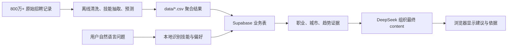

# 00. 项目是什么：把职业问题变成可追溯的建议

本篇是“职向量”零基础课件的起点。读完后，你会知道这个网站解决什么问题，为什么它不是简单地把问题丢给大模型，以及一次咨询从输入到回答经过了哪些步骤。

下一篇：[01-平台与角色](01-平台与角色.md)

## 你将学会什么

- 区分离线数据分析和网页在线问答。
- 读懂用户输入、招聘证据和最终建议之间的关系。
- 理解“模型可以写答案，但不能编造就业数据”的边界。

## 先区分两套系统

职向量背后有两套分工不同的系统。

第一套是**离线分析系统**。它处理约 800 万条上市公司历史招聘记录，完成职业映射、技能抽取、薪资和城市预测、AI 渗透率计算。这是重计算，适合在数据更新时运行，不适合每个用户提问时重新跑一遍。

第二套是**在线问答系统**。用户打开网页后，只查询已经准备好的聚合结果，例如“Python 在哪些职业中更常出现”“某项技能在 2028 年的预测需求”“两项技能是否曾在同一岗位中被直接观测到”。这样网页不需要扫描 800 万条原始记录。



## 一次咨询发生了什么

假设用户输入：

> 我会 Python、沟通能力和药学，想去一线城市，未来适合往哪个方向发展？

网页不会直接让模型凭印象回答。实际顺序如下：

1. 浏览器把问题发送给 `app/api/chat/route.ts`。
2. 服务端用 `lib/local-query.ts` 和数据库中的技能别名识别“Python、沟通能力、药学”，同时尝试理解城市、薪资、经验和年份偏好。
3. `lib/evidence.ts` 从 Supabase 的聚合表中找到技能画像、职业关系、城市预测和已观测的技能对。
4. 服务端先通过 SSE 把“已找到哪些技能、职业、城市、引用了哪些表”发给页面。用户不用等模型结束才知道系统是否在工作。
5. `lib/deepseek.ts` 把原问题和这批证据发给 DeepSeek。模型只负责把证据写成自然语言建议。
6. 如果模型在 50 秒内没有正常返回，`formatFallbackCareerAnswer` 用同一批证据生成本地建议；整个接口会在 60 秒内结束。

这里最重要的顺序是：**先查证据，后写答案**。

## 为什么不能让模型自己猜

语言模型擅长解释、归纳和写作，但它不知道本项目数据库里真实保存了哪些统计结果。若先让模型回答，再去找数据，很容易出现看似合理却没有来源的薪资、城市或趋势。

所以职向量把职责拆开：

| 角色 | 应做的事 | 不应做的事 |
|---|---|---|
| Supabase 数据库 | 保存和查询真实的聚合招聘指标 | 用自然语言给用户写建议 |
| 本地解析和排序代码 | 识别技能、执行确定的职业与城市排序 | 编造未观测到的关系 |
| DeepSeek | 基于已给出的证据组织完整解释 | 新造指标、城市、因果结论或工资数字 |

例如，若数据库没有直接观测到“Python”和“药学”这对技能，系统可以分别描述两个技能的趋势和相关职业，但不能声称它们组合后一定带来工资互补效应。这是一个重要的事实边界。

## 本项目不做什么

理解边界和理解功能同样重要。

- 它不在线逐条读取原始简历或原始招聘明细。
- 它不承诺用户一定能被某个岗位录用。
- 它不把技能共现当作因果关系，也不把相关性自动解释成工资溢价。
- 它不把 DeepSeek 的内部推理过程显示给用户；页面只显示最终回答和可追溯证据摘要。
- 它当前不做实时爬取职位或微信登录。它已可选匹配高校培养方案，并将课程推断能力与用户确认技能明确分开；更广的学校与专业覆盖仍可继续扩展。

## 动手看一次结果

在项目根目录运行：

```bash
npm run dev
```

打开 `http://localhost:3000`，登录后点击页面上的“技能组合”示例卡片并提交。正常情况下，你会先看到“本次已检索到的依据”，再看到完整的职业建议。

如果没有登录，页面会提示先登录。因为咨询历史需要与具体用户隔离保存，不能让所有人看到同一份会话记录。

## 安全提醒

提问时只写与职业决策有关的技能、经验、城市和薪资偏好。不要把身份证号、银行卡号、真实密码、邮件服务密钥或其他不需要用于职业分析的个人敏感信息输入到问题框中。系统需要的是职业画像，不是完整个人档案。

## 检查自己是否理解

回答下面三个问题：

1. 为什么网页不直接扫描 800 万条原始记录？
2. 如果模型回答很慢，系统使用哪一份信息生成兜底回答？
3. 为什么未观测到的技能组合不能被描述为“确定的工资互补”？

若你能回答“聚合表让查询更快”“同一份 Supabase 证据会被本地兜底复用”“没有直接证据就不能推断组合效果”，你已经掌握了项目的核心原则。

继续阅读：[01-平台与角色](01-平台与角色.md)。
