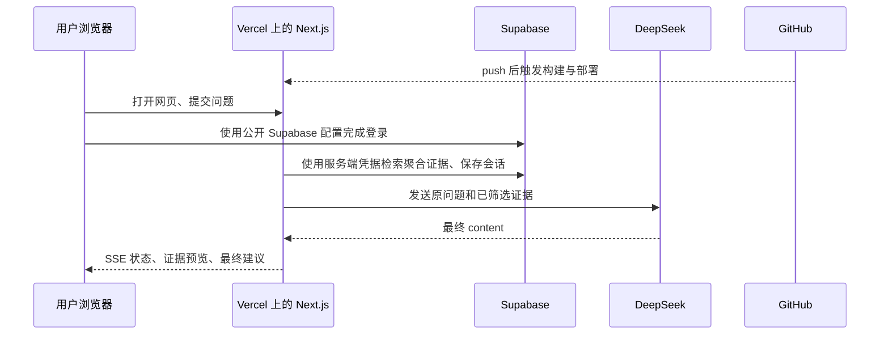

# 01. 平台与角色：每个工具负责哪一段

这一篇解释职向量使用的技术和平台。重点不是记名字，而是理解为什么同一个项目需要前端、服务器、数据库、模型和部署平台各司其职。

上一课：[00-项目是什么](00-项目是什么.md)  |  下一课：[02-数据如何变成职业建议](02-数据如何变成职业建议.md)

## 平台总览

把职向量想成一家有明确分工的小型服务：网页是接待员，Next.js 服务端是协调者，Supabase 是档案室，DeepSeek 是擅长写解释的顾问，Vercel 是把整个服务部署到公网的机房。

| 技术或平台 | 在本项目中的角色 | 对应位置 |
|---|---|---|
| Next.js 15 App Router | 同时提供网页和服务端接口 | `app/page.tsx`、`app/api/chat/route.ts` |
| TypeScript | 给数据、请求和回答加类型约束 | `types/`、`lib/` |
| Tailwind CSS | 实现响应式页面样式 | `app/globals.css`、组件中的 className |
| Supabase PostgreSQL | 保存技能、职业、城市和趋势聚合表 | `supabase/schema.sql` |
| Supabase Auth | 发送 Email OTP、维护用户会话 | `components/career-workbench.tsx`、`middleware.ts` |
| DeepSeek API | 根据真实证据生成最终可读建议 | `lib/deepseek.ts` |
| GitHub | 保存版本历史、承接代码推送 | Git 远程仓库 |
| Vercel | 构建并托管 Next.js 网站与接口 | `vercel.json` |

## 每个平台像什么

### Next.js：一个项目里的网页和后端

传统网站常把前端和后端拆成两个仓库。Next.js 可以把它们放在同一个项目中：

- `app/page.tsx` 负责首页。
- `components/career-workbench.tsx` 是用户输入、登录、聊天和历史会话的客户端界面。
- `app/api/chat/route.ts` 是只在服务端运行的问答接口。

这让同一份 TypeScript 类型可以被界面和接口共享，也让部署更直接。

### Supabase：数据库加认证服务

Supabase 提供 PostgreSQL 数据库和 Auth。数据库里既有公开业务聚合数据，也有登录用户自己的 `conversations` 和 `messages`。Auth 负责邮箱验证码和会话 Cookie。

项目不是把 CSV 放到网页服务器上查询，而是先把汇总数据导入 Supabase。这样线上接口能按技能、城市和年份条件查询，也能用权限规则隔离用户历史。

### DeepSeek：只负责解释，不负责取数

`lib/deepseek.ts` 将用户原问题和 `CareerEvidence` 传给 DeepSeek。思考模式在服务端执行，程序只读取最终的 `message.content`。模型看不到浏览器中的密钥，也不会直接连接 Supabase。

### Vercel：把 Git 提交变成可访问网站

Vercel 连接 GitHub 仓库后，会为推送到生产分支的提交构建 Next.js 应用。它提供 HTTPS 域名、运行服务端 Route Handler 的函数环境，以及供服务端读取的环境变量。

## 它们如何连接



需要注意，浏览器与 Supabase 的连接仅用于用户登录和受 RLS 保护的个人会话。真正的业务证据检索发生在 Next.js 服务端，服务端的密钥不发送到浏览器。

## 公开变量和秘密变量

环境变量是部署平台提供给程序的配置。名字以 `NEXT_PUBLIC_` 开头的变量会被打包到浏览器代码中，因此只能放可公开的信息。

| 变量 | 可否在浏览器出现 | 用途 |
|---|---|---|
| `NEXT_PUBLIC_SUPABASE_URL` | 可以 | 告诉浏览器要连接哪个 Supabase 项目。 |
| `NEXT_PUBLIC_SUPABASE_ANON_KEY` | 可以 | 浏览器登录和受 RLS 限制查询所用的公开匿名密钥。 |
| `DEEPSEEK_API_KEY` | 不可以 | 只能由服务端调用 DeepSeek 时读取。 |
| `SUPABASE_SERVICE_ROLE_KEY` | 不可以 | 可绕过 RLS，线上证据检索和导入时只能在服务端使用。 |
| `DEEPSEEK_THINKING_MODE`、`DEEPSEEK_ANSWER_TIMEOUT_MS` | 不需要公开 | 服务端控制思考模式和 50 秒模型上限。 |

绝不要把秘密变量写进组件、提交到 GitHub，或以 `NEXT_PUBLIC_` 前缀命名。`data/` 也被 `.vercelignore` 排除，Vercel 的生产函数不应依赖本地 CSV 文件。

## 动手检查

在项目根目录运行：

```bash
npm run typecheck
npm run lint
```

第一条检查 TypeScript 类型是否一致，第二条检查代码风格和常见错误。两条命令都应以退出码 0 结束。

然后打开 `lib/env.ts`，你会看到浏览器公开变量通过静态名字读取，而 DeepSeek 与 service-role 凭据只由服务端函数读取。这就是“公开配置”和“服务端秘密”在代码中的分界线。

## 检查自己是否理解

1. 为什么 `SUPABASE_SERVICE_ROLE_KEY` 不能放在网页组件里？
2. 为什么 Vercel 不需要携带 `data/*.csv` 才能回答问题？
3. 为什么 DeepSeek 不应该直接查询数据库？

答案分别是：它能绕过数据库行级权限；线上查询使用已导入的 Supabase 聚合表；模型只应解释已经筛选的证据，避免越权和编造。

继续阅读：[02-数据如何变成职业建议](02-数据如何变成职业建议.md)。
