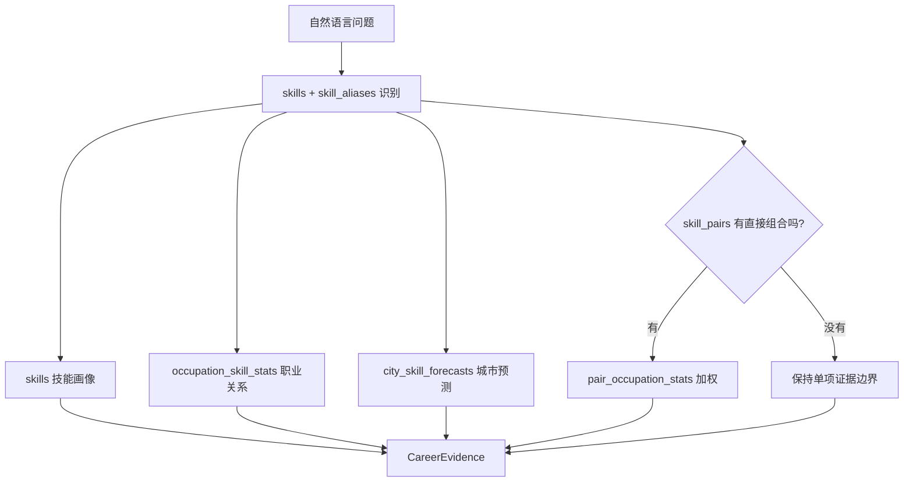

# 02. 数据如何变成职业建议：从招聘明细到聚合表

这一篇讲数据链路。目标不是教你重新训练预测模型，而是让你理解网页为什么能快速给出职业、城市和技能建议，以及每张 Supabase 表在其中起什么作用。

上一课：[01-平台与角色](01-平台与角色.md)  |  下一课：[03-从零搭建前后端](03-从零搭建前后端.md)

## 从原始招聘到聚合数据

原始招聘记录数量大、字段复杂，而且每次网页咨询只需要其中很小一部分信息。职向量先在离线阶段完成重计算：

1. 把岗位映射到《职业大典》的职业小类。
2. 从职位文本提取技术技能、专业知识和非技术能力。
3. 按技能、城市、职业和年份汇总需求、薪资、经验、学历与预测结果。
4. 计算技能共现、直接组合证据与 AI 渗透率。
5. 导出 `data/` 下的 CSV，再导入 Supabase。

离线阶段像“把大量票据整理成索引卡”；线上阶段只需要根据问题快速拿对应的索引卡。

## 导入 Supabase 的原因

导入脚本是 `scripts/import-supabase.ts`，运行命令为：

```bash
npm run import:data
```

脚本会从 `.env.local` 读取 `NEXT_PUBLIC_SUPABASE_URL` 和只限服务端使用的 `SUPABASE_SERVICE_ROLE_KEY`。它使用 `upsert` 分批写入，每批最多 500 行。分批的原因是避免一次 HTTP 请求带太多 CSV 行，导致请求太大、失败后难以定位问题。

第一次使用时，先在 Supabase SQL Editor 执行 `supabase/schema.sql`，再运行导入命令。导入器也支持按区段重跑：

```bash
npm run import:data -- --section skills
npm run import:data -- --section aliases
npm run import:data -- --section relations
npm run import:data -- --section supplemental
```

这些命令适合某一批 CSV 修正后局部重导，而不是把数据库手动删空。不要在不理解后果时执行 `DROP TABLE` 或删除生产表。

## 表如何协作

| 表 | 主要内容 | 在线问答怎样使用 |
|---|---|---|
| `skills` | 标准技能、需求、薪资、经验、学历、AI 指标与预测 JSON | 构建技能画像和趋势解释。 |
| `skill_aliases` | 别名到标准技能名称的映射 | 把用户写的不同表达识别成同一技能。 |
| `skill_pairs` | 已观测技能对、共现和组合趋势 | 判断是否真的有直接组合证据。 |
| `occupation_skill_stats` | 技能与职业小类的匹配关系 | 排序职业推荐。 |
| `city_skill_forecasts` | 技能、城市、预测年份的需求 | 排序城市推荐。 |
| `pair_occupation_stats` | 技能组合与职业关系 | 仅在组合已观测时增强职业排序。 |
| `pair_city_stats` | 技能组合与城市关系 | 已导入，当前为组合城市排序预留。 |
| `skill_yearly_trends` | 年度需求、薪资、经验 | 为趋势图和细粒度解读预留。 |
| `skill_monthly_trends` | 月度需求、薪资、经验 | 为时间序列展示预留。 |
| `skill_ai_exposure` | 技能在不同 AI 职业组中的变化 | 为 AI 分组解释预留。 |
| `conversations`、`messages` | 用户自己的会话和消息 | 保存可回看的咨询历史。 |

这些表的主键、外键、索引和 RLS 定义都在 `supabase/schema.sql`。例如，`skill_aliases.canonical_name` 关联到 `skills.canonical_name`，这样一个别名不能指向不存在的标准技能。

## 在线排序的边界

`lib/evidence.ts` 会并发查询必要的表，再调用 `lib/ranking.ts` 计算职业、城市和下一技能排序。它不会把整张 `skill_pairs` 下载到服务器内存，而是只查询命中技能相关的组合。

这里有三条不能跨越的边界：

- **技能没识别出来**：返回“暂无相关记录”，不让模型猜一个技能。
- **组合没有直接观测**：可分别说明单项技能，但不能推断组合的工资互补效应。
- **用户写了目标城市或薪资**：这些是排序和解释时的偏好，不等于平台保证岗位一定满足条件。



## 动手检查

在 Supabase SQL Editor 中可以安全地执行只读行数检查：

```sql
SELECT COUNT(*) FROM public.skills;
```

再对其他关键表分别执行：

```sql
SELECT COUNT(*) FROM public.skill_aliases;
SELECT COUNT(*) FROM public.skill_pairs;
SELECT COUNT(*) FROM public.occupation_skill_stats;
SELECT COUNT(*) FROM public.city_skill_forecasts;
```

如果某张表行数为 0，先检查导入器控制台里对应的“第 N 批导入失败”信息，再确认 CSV 文件名、列名和 `.env.local` 的服务端密钥是否正确。不要先修改网页代码，因为网页只是读取这些已经导入的表。

## 检查自己是否理解

1. 为什么导入脚本每 500 行写一次？
2. `skill_aliases` 和 `skills` 分别解决什么问题？
3. 为什么“没有观测到技能对”不是“两个技能完全没有关系”？

答案是：分批能控制请求大小和失败范围；前者解决用户写法，后者保存标准技能事实；没有观测只说明本数据集没有足够的直接组合证据，不能推出现实中绝对没有关系。

继续阅读：[03-从零搭建前后端](03-从零搭建前后端.md)。
