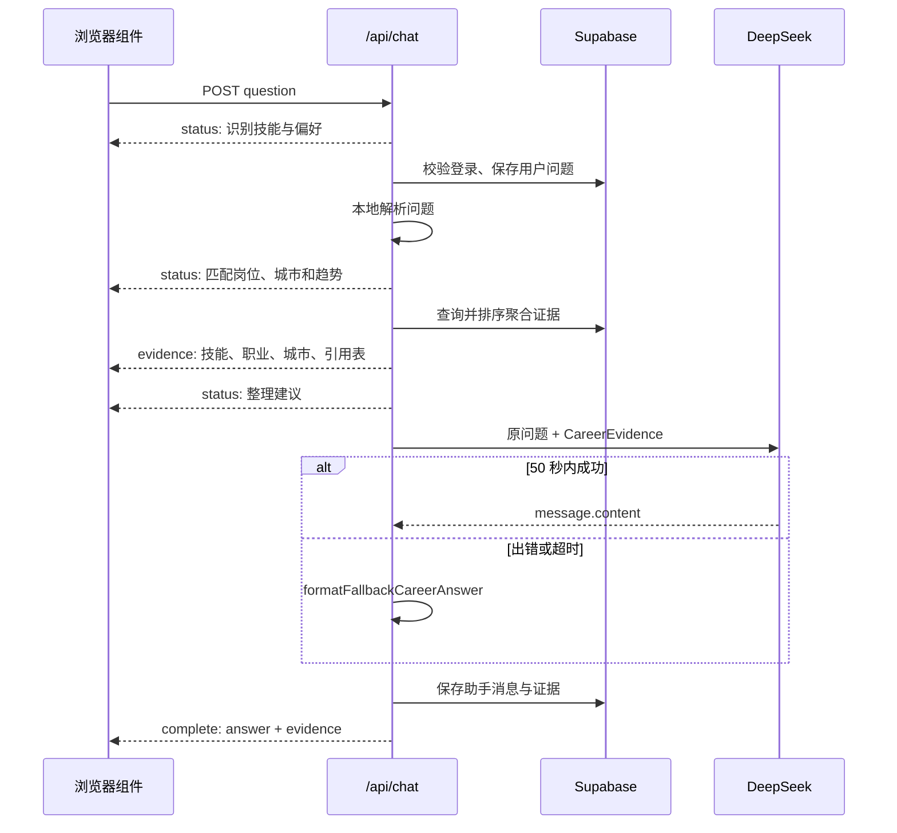

# 03. 从零搭建前后端：一次问题如何流到最终回答

这一篇把“网页、接口、数据库、模型”连成一次完整请求。它适合已经知道项目目标，但还不熟悉 Next.js 前后端如何协作的读者。

上一课：[02-数据如何变成职业建议](02-数据如何变成职业建议.md)  |  下一课：[04-登录、邮件与安全](04-登录、邮件与安全.md)

## 页面和接口为什么在一个项目里

职向量使用 Next.js App Router。你可以把它理解成一个项目同时包含两类文件：

- **页面和组件**：负责让用户输入、点击、看见状态和历史记录。主要文件是 `app/page.tsx` 与 `components/career-workbench.tsx`。
- **Route Handler**：负责在服务器上校验登录、查询 Supabase、调用 DeepSeek。主要文件是 `app/api/chat/route.ts`。

浏览器里的组件不能直接读取 `DEEPSEEK_API_KEY` 或 `SUPABASE_SERVICE_ROLE_KEY`。把这些工作放在 Route Handler 中，密钥才不会被下载到用户的浏览器。

## 提问接口的四个阶段

用户点击发送按钮后，`CareerWorkbench.submit` 会向 `/api/chat` 发送：

```ts
{ question: "用户输入的自然语言", conversationId: "可选的历史会话 ID" }
```

服务器处理顺序如下：

1. **身份和会话**：Route Handler 检查问题长度、读取 Supabase claims，创建或复用 `conversations`，保存用户问题到 `messages`。
2. **本地理解**：`parseCareerQuestionFromCatalog` 从技能与别名词典中识别技能、城市、薪资、经验、学历、年份和咨询意图。这里不需要先调用模型，因此不会产生“模型返回了非法 JSON”的问题。
3. **证据检索与排序**：`retrieveCareerEvidence` 查询技能、职业、城市和已观测技能组合。`lib/ranking.ts` 根据这些数据得到推荐排序。
4. **生成或兜底**：`writeCareerAnswer` 将原问题与证据交给 DeepSeek。若模型网络异常、内容无效或超过 50 秒，Route Handler 改用 `formatFallbackCareerAnswer(evidence)`。



## 为什么使用 SSE

SSE 是 Server-Sent Events 的缩写，可以把它理解成“服务器在同一次 HTTP 请求里分多次向网页报进度”。这里不需要浏览器持续向服务器推送多条消息，所以 SSE 比 WebSocket 更简单。

`lib/chat-stream.ts` 负责把事件编码和解码。当前接口有四种事件：

| 事件 | 何时发送 | 页面怎么处理 |
|---|---|---|
| `status` | 识别、检索、生成、兜底阶段切换时 | 更新加载提示文字。 |
| `evidence` | Supabase 查询和排序结束后 | 立即显示技能、职业、城市和引用表。 |
| `complete` | 最终回答已经生成并保存后 | 写入对话区，刷新历史会话。 |
| `error` | 登录、数据库或服务端处理失败时 | 停止加载并显示具体错误。 |

客户端使用 `response.body.getReader()` 和 `TextDecoder` 逐块读取。网络传输可能把一个事件拆在两个数据块里，`decodeChatStream` 会保存未完成部分，等下一块到来再解析，避免半截 JSON 报错。

## 模型回答为什么可信

“可信”不表示预测绝对正确，而是表示回答不会脱离这次检索到的证据。

`lib/deepseek.ts` 的系统提示词要求模型：

- 只能使用传入的 `CareerEvidence`。
- 不编造薪资、城市、趋势、概率或因果。
- 没有直接观测到的技能组合时，不推断组合工资互补效应。
- 第一段先给行动建议，再解释岗位、城市、趋势、AI 影响和下一技能。

DeepSeek 的思考模式只在服务端运行。代码读取的接口字段只有 `choices[].message.content`，内部的推理字段不会进入 SSE、Supabase 的 `messages.evidence` 或页面。这既减少无关信息，也避免把模型内部过程误当作可验证事实。

### 50 秒和 60 秒分别是什么

| 时间 | 位置 | 原因 |
|---|---|---|
| 50 秒 | `DEEPSEEK_ANSWER_TIMEOUT_MS` | 主动停止过慢的模型请求。 |
| 60 秒 | `app/api/chat/route.ts` 和 `vercel.json` 的 `maxDuration` | 给兜底回答、保存消息和 SSE `complete` 留出时间。 |

因此，用户看到“生成服务较慢，已依据同一批证据整理建议”时，并不表示数据消失了，而是模型阶段被放弃，系统换成确定的本地呈现逻辑。

## 动手验证

先启动项目：

```bash
npm run dev
```

然后打开浏览器开发者工具的 Network 面板，提交一个已知技能的示例问题。选择 `/api/chat` 请求，响应头应包含：

```text
Content-Type: text/event-stream; charset=utf-8
Cache-Control: no-cache, no-transform
```

页面应先显示“本次已检索到的依据”，最后才追加“数据解读”。若没有登录，接口会发送“请先登录后再咨询”，这是预期的权限保护。

## 检查自己是否理解

1. 为什么用户能在最终文字出现前先看到证据？
2. 为什么 DeepSeek 不能直接拿到浏览器里的 service-role 密钥？
3. 模型超时后回答所依据的数据来自哪里？

答案是：SSE 先发送 `evidence`；秘密只在 Route Handler 的环境中读取；兜底复用同一个 `CareerEvidence`。

继续阅读：[04-登录、邮件与安全](04-登录、邮件与安全.md)。
