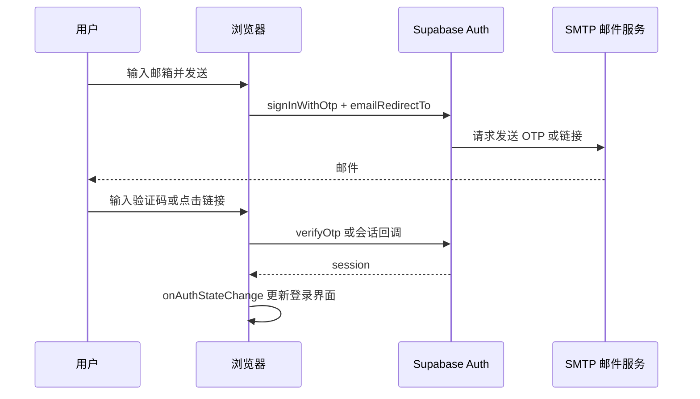

# 04. 登录、邮件与安全：OTP、回调地址和密钥边界

本篇解释职向量为什么要求登录、邮箱验证码如何工作，以及此前最容易遇到的回调、限流和 SMTP 问题应该怎样定位。

上一课：[03-从零搭建前后端](03-从零搭建前后端.md)  |  下一课：[05-部署、域名与环境变量](05-部署、域名与环境变量.md)

## 为什么需要登录

职业统计数据可以作为公共业务数据被服务端查询，但咨询记录属于个人数据。登录后，系统才能把 `conversations` 与 `messages` 关联到当前用户，并用 Row Level Security，简称 RLS，限制用户只能读取和修改自己的记录。

在 `supabase/schema.sql` 中，`conversations.user_id` 和 `messages.user_id` 关联 Supabase Auth 的 `auth.users`。对应的 RLS policy 比较 `auth.uid()` 与行里的 `user_id`。这意味着即使用户在浏览器里修改请求，也不能合法读取其他用户的会话。

## OTP 登录的真实流程

OTP 是一次性验证码。职向量当前的界面逻辑在 `components/career-workbench.tsx`：

1. 用户输入邮箱，点击发送。
2. 前端调用 `supabase.auth.signInWithOtp`，并把当前网站地址作为 `emailRedirectTo`。
3. Supabase Auth 通过配置好的邮件服务发送验证码或登录链接。
4. 用户输入验证码时，前端调用 `supabase.auth.verifyOtp({ email, token, type: "email" })`。
5. 验证成功后，浏览器获得会话；`onAuthStateChange` 监听状态变化并刷新历史咨询。
6. `middleware.ts` 在页面请求时调用 Supabase 会话刷新逻辑，使服务器侧 Route Handler 能读取用户 claims。



## 回调地址必须匹配

在 Supabase Dashboard 的 Authentication -> URL Configuration 中，有两个概念：

- **Site URL**：当代码没有指定回调地址时的默认跳转地址。生产环境应设置为正式域名。
- **Redirect URLs**：允许 `emailRedirectTo` 跳转到的地址白名单。

本项目调用 `getEmailRedirectUrl(window.location.origin)`，因此本地开发和生产域名都会随着当前网页地址传给 Supabase。它们必须存在于 Redirect URLs 中，否则邮件链接可能回到旧的 localhost，或者认证后出现连接失败。

本地调试可以保留：

```text
http://localhost:3000/**
```

生产环境应加入自己的正式 HTTPS 域名。若需要 Vercel 预览部署，可以按 [Supabase Redirect URLs 文档](https://supabase.com/docs/guides/auth/redirect-urls) 使用受限的 Vercel 预览匹配规则；正式域名尽量使用精确地址，而不是宽泛通配符。

## 邮件服务为什么会限流

Supabase 自带的邮件服务适合演示，不适合生产登录。官方文档说明默认服务有严格限制，当前可能只有每小时两封，并且未配置自定义 SMTP 时还可能只允许项目团队成员邮箱。遇到 `email rate limit exceeded` 时，等待一分钟通常无效，因为限制是按更长的窗口计算的。[Supabase Custom SMTP](https://supabase.com/docs/guides/auth/auth-smtp)

生产环境应使用自定义 SMTP。以 Resend 为例，安全的配置步骤是：

1. 在 Resend 添加自己的发信域名，并按页面给出的 DNS 记录完成验证。
2. 在 Resend 创建专用于 SMTP 的 API key。它只能填到 Supabase SMTP 设置，不能写进 GitHub、Vercel 前端变量或聊天记录。
3. 在 Supabase Authentication 的 SMTP Settings 启用 Custom SMTP，填写：

```text
Host: smtp.resend.com
Port: 465
Username: resend
Password: Resend 创建的 SMTP/API key
Sender: noreply@your-domain
Sender name: 职向量
```

4. 保存后只发送一封测试 OTP，再查看 Supabase Auth 日志和 Resend Emails/Logs。

Resend 的 [Supabase SMTP 指南](https://resend.com/docs/send-with-supabase-smtp) 可用于核对当前服务商设置。邮件**接收**所需的 MX 记录与“从你的域名发送 OTP”是两件事；若本项目只需要发信，不要为了 OTP 去改动已有邮件接收 MX 记录。

## 密钥与权限边界

| 内容 | 放在哪里 | 为什么 |
|---|---|---|
| `NEXT_PUBLIC_SUPABASE_URL`、`NEXT_PUBLIC_SUPABASE_ANON_KEY` | 本地 `.env.local` 和 Vercel 环境变量 | 浏览器需要它们建立 Auth 会话；权限仍受 RLS 限制。 |
| `SUPABASE_SERVICE_ROLE_KEY` | 仅本地导入脚本和 Vercel 服务端环境变量 | 它可绕过 RLS，绝不能传给浏览器。 |
| `DEEPSEEK_API_KEY` | 仅 Vercel 服务端和本地 `.env.local` | 只允许 Route Handler 调用模型。 |
| SMTP/API key | 仅 Supabase SMTP Settings | 它属于邮件服务凭据，不属于前端配置。 |
| `RESEND_API_KEY` | 仅 Vercel 服务端环境变量 | `app/api/feedback/route.ts` 用它发送问题反馈，不能放到浏览器。 |

`.env.local` 应在 `.gitignore` 中。即使某项密钥“看起来能公开”，也不要把它复制进 Markdown、截图、提交信息或页面组件。

## 常见现象的第一判断

| 看到的提示 | 先检查哪里 | 常见原因 |
|---|---|---|
| `email rate limit exceeded` | Supabase Authentication -> Rate Limits | 仍在使用默认邮件服务，或达到发信窗口限制。 |
| `Error sending magic link email` | Supabase SMTP Settings、Resend Logs | SMTP 主机、端口、用户名、密码、发件人域名未正确保存或未验证。 |
| 邮件链接跳回 localhost | Supabase URL Configuration | Site URL 或 Redirect URLs 还保留旧地址，或没有允许当前生产域名。 |
| 回到网页却没有显示登录 | 浏览器控制台、Auth 状态监听 | 会话没有建立，或前端没有响应 `SIGNED_IN` 状态。 |

## 检查清单

在上线前逐项确认：

1. Email Provider 已启用。
2. Site URL 是正式域名，Redirect URLs 同时包含正式域名和本地 `http://localhost:3000/**`。
3. 已配置并测试自定义 SMTP，发送域名在邮件服务商处显示已验证。
4. 浏览器只拿到 `NEXT_PUBLIC_` 变量，service-role 和 DeepSeek 密钥没有出现在客户端。
5. 登录后只能看到自己的会话；退出后会话列表被清空。

继续阅读：[05-部署、域名与环境变量](05-部署、域名与环境变量.md)。
