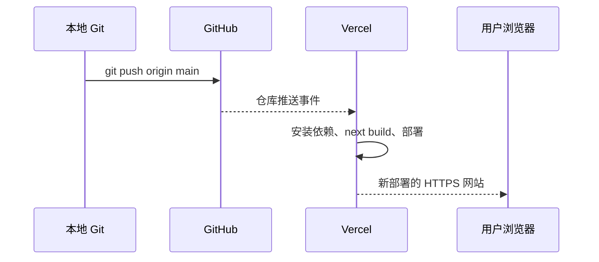

# 05. 部署、域名与环境变量：从本地到公网

这一篇面向第一次部署网站的读者。你会学会哪些文件应该上传、Git 的三个常用命令分别做什么、Vercel 为什么会自动部署，以及域名和 Supabase 回调地址为什么必须同步修改。

上一课：[04-登录、邮件与安全](04-登录、邮件与安全.md)  |  下一课：[06-故障排查与真实踩坑](06-故障排查与真实踩坑.md)

## 上线前的文件边界

先理解哪些内容可以进入 GitHub，哪些必须留在本地或平台设置中。

| 内容 | 应否提交到 GitHub | 原因 |
|---|---|---|
| `app/`、`components/`、`lib/`、`tests/` | 应提交 | 这是网站代码和测试。 |
| `README.md`、`docs/`、`supabase/schema.sql` | 应提交 | 这是使用说明和可复现的数据库结构。 |
| `.env.example` | 应提交 | 只列出变量名和安全默认值，不含密钥。 |
| `.env.local` | 不应提交 | 包含本地密钥和项目配置。 |
| `node_modules/` | 不应提交 | 可由 `package-lock.json` 重新安装。 |
| 大型原始数据或私有 CSV | 通常不应提交 | 文件体积大且线上应用已经查询 Supabase；本项目也通过 `.vercelignore` 排除 `data/`。 |

上传前可以运行：

```bash
git status --short
```

它会列出未跟踪或已修改的文件。看到 `.env.local`、密钥导出文件或不该上传的数据时，先停止，不要执行 `git add .`。

## 从本地到 GitHub

Git 有三个容易混淆的阶段：工作区、暂存区、本地提交历史。

1. `git add`：选择“这次要放进下一次提交”的文件。
2. `git commit`：在本机创建一个带说明的版本快照。
3. `git push`：把本机提交发送到 GitHub 远程仓库。

一个安全的示例流程如下。请按实际修改的文件替换路径，不要无差别暂存：

```bash
git status --short
git add app/api/chat/route.ts lib/deepseek.ts tests/deepseek.test.ts
git diff --cached --check
git commit -m "feat: improve career answer generation"
git push origin main
```

每条命令的意义：

- `git status --short` 先看改了什么。
- `git add ...` 只选择本次功能相关文件。
- `git diff --cached --check` 检查暂存区的空白错误。
- `git commit -m` 只保存到本机历史，尚未上传。
- `git push origin main` 才会把 `main` 发送到 GitHub。

如果 `git push` 需要登录，不要把访问令牌复制到聊天记录、源代码或 `.env.example`。使用浏览器已登录的 Git Credential Manager、GitHub Desktop 或 GitHub 的官方认证流程完成登录。

## Vercel 自动部署如何发生

在 Vercel 导入 GitHub 仓库并选择生产分支后，Vercel 会监听该分支的新提交。通常流程是：



“通常”很重要。自动部署的前提是：Vercel 项目仍连接正确的 GitHub 仓库、Production Branch 是 `main`、推送实际成功、构建没有失败。Vercel 显示 Ready 只说明构建和部署完成，不等于登录、问答和环境变量都正确。

部署后应同时确认：

1. GitHub 上的最新提交 ID 与 Vercel Deployment 显示的提交一致。
2. 网站首页能打开，浏览器控制台没有 client-side exception。
3. 已登录用户提交示例问题时，先看到证据，再在一分钟内看到模型回答或本地兜底。

## 配置生产环境变量

在 Vercel Project Settings -> Environment Variables 中，为 **Production** 环境配置下列变量。变量名必须与 `.env.example` 完全一致：

```text
DEEPSEEK_API_KEY
DEEPSEEK_ANSWER_MODEL
DEEPSEEK_THINKING_MODE
DEEPSEEK_ANSWER_TIMEOUT_MS
NEXT_PUBLIC_SUPABASE_URL
NEXT_PUBLIC_SUPABASE_ANON_KEY
SUPABASE_SERVICE_ROLE_KEY
RESEND_API_KEY
FEEDBACK_TO_EMAIL
FEEDBACK_FROM_EMAIL
```

推荐值：

```text
DEEPSEEK_ANSWER_MODEL=deepseek-v4-flash
DEEPSEEK_THINKING_MODE=enabled
DEEPSEEK_ANSWER_TIMEOUT_MS=50000
```

其余密钥从 Supabase 和 DeepSeek 对应控制台复制，但不要把值写进文档或源码。尤其要注意：任何以 `NEXT_PUBLIC_` 开头的变量都会在构建时进入浏览器，因此绝不能把 service-role、DeepSeek 或 SMTP 密钥加上这个前缀。

环境变量变更后必须触发一次新的部署，因为 `NEXT_PUBLIC_` 值在 Next.js 构建阶段被打入前端代码。最直接的方法是在 Vercel 对当前提交 Redeploy，或推送一个新的已验证提交。

## 绑定域名后的两个同步点

假设你已经在 Vercel 的 Domains 添加并验证自己的域名，DNS 也按照 Vercel 页面给出的记录生效。不要只看域名解析成功，还要同步 Supabase Auth。

1. 在 Supabase Authentication -> URL Configuration，把 **Site URL** 改成正式的 `https://你的域名`。
2. 在 **Redirect URLs** 添加正式域名对应的允许地址；本地开发仍可保留 `http://localhost:3000/**`。

原因是：邮箱 OTP 或链接需要知道认证成功后跳回哪里。前端会将当前网页地址传给 `emailRedirectTo`，Supabase 只允许它跳到白名单中的地址。有关生产 Site URL、预览 URL 和通配符的规则见 [Supabase Redirect URLs 文档](https://supabase.com/docs/guides/auth/redirect-urls)。

## 上线检查

推送前，在项目根目录执行：

```bash
npm run typecheck
npm test
npm run lint
npm run build
```

四条命令都应成功。随后执行 `git status --short`，确认没有 `.env.local` 或无关数据文件，再推送。

部署后按这个顺序测试：

1. 打开正式域名，确认首页可见。
2. 用一个真实邮箱请求 OTP，确认邮件中的链接或验证码对应正式域名。
3. 登录后提交一个示例问题，确认 SSE 证据预览出现。
4. 等待最终建议或本地兜底，最长不超过一分钟。
5. 在 Vercel Logs、Supabase Auth Logs 和浏览器控制台查看首个错误，而不是只反复点击重试。

## 检查自己是否理解

1. `git commit` 和 `git push` 分别发生在哪里？
2. 为什么改了 `NEXT_PUBLIC_` 变量后需要重新部署？
3. 为什么绑定域名后还要去 Supabase 修改 Site URL 和 Redirect URLs？

答案是：commit 只写本机历史，push 才上传 GitHub；公开变量在构建时进入浏览器文件；OTP 认证必须跳回 Supabase 允许的正式地址。

继续阅读：[06-故障排查与真实踩坑](06-故障排查与真实踩坑.md)。
