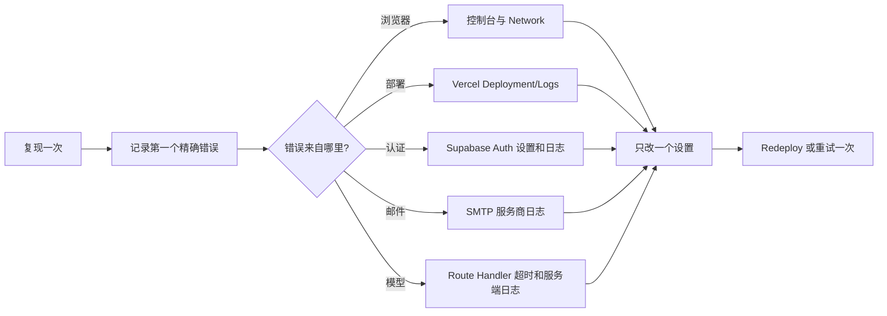

# 06. 故障排查与真实踩坑：从现象到第一个证据

这篇是项目的排查手册。原则很简单：不要根据猜测连续改很多设置。先复现一次，记录第一个精确错误，再去对应的平台检查，最后只改一个设置并重新验证。

上一课：[05-部署、域名与环境变量](05-部署、域名与环境变量.md)

## 先记住排查顺序



“第一个精确错误”比“页面好像不对”有用得多。例如 `缺少环境变量：NEXT_PUBLIC_SUPABASE_URL`、`email rate limit exceeded`、`Error sending magic link email` 都已经指向完全不同的层。

## 常见问题表

| 现象 | 常见原因 | 第一个诊断位置 | 修复动作 |
|---|---|---|---|
| `缺少环境变量：NEXT_PUBLIC_SUPABASE_URL` | 本地 `.env.local` 没有变量，或 Vercel 没保存到 Production，或变量改后没重新构建。 | 本地终端或浏览器控制台；Vercel Environment Variables。 | 确认变量名完全一致、URL 非空、环境选了 Production；重启 `npm run dev` 或 Redeploy。不要把 service-role 改成 `NEXT_PUBLIC_`。 |
| Vercel 页面显示 client-side exception | 构建时缺少公开 Supabase 变量、前端代码异常，或浏览器仍缓存旧部署。 | 浏览器控制台的第一条红色错误；Vercel Deployment 的实际提交 ID。 | 先修第一条错误；确认 GitHub 推送提交与部署提交相同；公开变量变更后重新部署。 |
| 邮件链接仍跳转到 localhost | Supabase 的 Site URL 或 Redirect URLs 仍保留旧值，或正式域名不在允许列表。 | Supabase Authentication -> URL Configuration。 | Site URL 改为正式 HTTPS 域名；Redirect URLs 加正式域名，同时保留本地 `http://localhost:3000/**` 供开发。 |
| `email rate limit exceeded` | 仍使用 Supabase 默认邮件服务，已达到其发信窗口。 | Supabase Authentication -> Rate Limits 和 SMTP Settings。 | 不要每分钟反复发送；配置自定义 SMTP，保存后只发送一次测试邮件。等待一分钟不能改变按小时限制。 |
| `Error sending magic link email` | SMTP 凭据、端口、发件人或发送域名没有正确验证。 | Supabase SMTP Settings、邮件服务商的发送日志。 | 核对 SMTP host/port/username/password 与已验证的发件人域名；保存后只测试一次。不要改动接收邮件的 MX 记录来修复发信。 |
| 点击邮件后回到网页但界面仍像未登录 | 会话未建立、回调地址不匹配，或客户端没有处理 Auth 状态变化。 | 浏览器控制台、Supabase Auth Logs、`components/career-workbench.tsx`。 | 确认 `emailRedirectTo` 当前来源已在 Redirect URLs；确认 `onAuthStateChange` 收到登录状态并刷新会话列表。 |
| 一直显示“正在整理建议” | DeepSeek 慢、网络失败，或 Vercel 函数的时间预算不一致。 | 浏览器 Network 的 `/api/chat` 流；Vercel 函数日志；`lib/deepseek.ts`。 | 保持 60 秒 Route Handler/Vercel 上限和 50 秒模型超时；模型异常后应出现 fallback 状态并返回本地证据建议。 |

## 场景一：本地变量缺失

如果浏览器报：

```text
缺少环境变量：NEXT_PUBLIC_SUPABASE_URL
```

按顺序做：

1. 确认项目根目录有 `.env.local`，不是 `.env.local.txt`。
2. 对照 `.env.example`，确认变量名是 `NEXT_PUBLIC_SUPABASE_URL` 和 `NEXT_PUBLIC_SUPABASE_ANON_KEY`。
3. 保存后完全停止并重新运行开发服务器：

```bash
npm run dev
```

Next.js 会在启动时读取环境变量。只修改文件但不重启，浏览器仍可能加载旧的构建结果。

## 场景二：Vercel 已显示 Ready，但网站还是坏的

Ready 只说明 Vercel 成功构建并发布文件。它不证明数据库密钥、登录回调、DeepSeek 调用或浏览器代码都正确。

依次检查：

```bash
git log -1 --oneline
git ls-remote origin refs/heads/main
```

本地提交和远程 `main` 应指向同一版本。然后在 Vercel Deployment 页面确认部署的 commit SHA 也是这个版本。最后在浏览器打开生产地址，查看 Console 第一条错误，而不是只看部署卡片的 Ready 标签。

## 场景三：OTP 邮件和自定义 SMTP

常见误区是把“邮件接收 DNS”与“认证发信配置”混为一谈。OTP 发不出去时，先看发信链路：

```text
网页 signInWithOtp
  -> Supabase Auth
  -> Custom SMTP
  -> 发送服务商日志
  -> 收件箱
```

如果域名验证已完成但仍报发送错误，通常是 Supabase SMTP Settings 没保存、使用了错误端口、用户名不是服务商要求的值、密码不是当前有效 key，或 Sender 地址不属于已验证域名。先在邮件服务商日志中看拒绝原因，再一次只修一个配置。

## 场景四：模型响应太长或太慢

当前项目的边界是：

```text
Next.js Route Handler / Vercel：最多 60 秒
DeepSeek 单次调用：最多 50 秒
剩余时间：本地兜底、保存会话、发送 complete
```

这不是让用户必须等满一分钟。证据检索完成后，页面会先显示证据预览；模型正常返回时就立刻结束。只有模型异常、网络问题或长时间思考时，才使用 `formatFallbackCareerAnswer`。它复用同一份 Supabase 证据，因此不会编造新数据。

若经常触发兜底，检查 Vercel Logs 中接口总耗时、DeepSeek API 响应、Supabase 检索耗时和模型设置。不要先把超时无限加长，因为函数超出平台限制可能被强制终止，用户反而拿不到兜底回答。Vercel 的 `maxDuration` 是函数允许运行的最长时间，官方说明超时会终止函数，因此应用应主动留出缓冲。[Vercel Function Duration](https://vercel.com/docs/functions/configuring-functions/duration)

## 一次完整的排查示例

假设用户说“验证码发送失败”。一个可复现的排查过程是：

1. 只点击一次发送，记录页面的完整错误文本。
2. 如果错误是 `email rate limit exceeded`，去 Supabase Rate Limits；不要先改 Redirect URLs。
3. 如果错误是 `Error sending magic link email`，去 Supabase SMTP Settings 和邮件服务商 Logs；不要先改网页代码。
4. 修正一个设置后重新保存，只发送一次测试邮件。
5. 邮件到达后，确认链接回到正式域名；若回到 localhost，再检查 URL Configuration。
6. 登录成功后，提交一个示例问题，观察是否先出现证据、后出现回答或兜底。

这个顺序避免了“同时改 SMTP、DNS、Vercel、前端代码，然后不知道究竟哪一步生效”的问题。

## 检查自己是否理解

1. 为什么 `email rate limit exceeded` 不应该先修改前端页面？
2. 为什么 Vercel Ready 后还要打开真实网站检查？
3. 为什么模型的超时要小于函数时限？

答案是：限流属于邮件服务配置；Ready 不验证真实用户路径；较短的模型超时给本地证据兜底和 SSE 结束留出了时间。

你已经完成全部课件。返回 [README](../../README.md) 可从目录重新开始，或阅读 [项目架构与数据流](../PROJECT_ARCHITECTURE.md) 查看更详细的工程说明。
