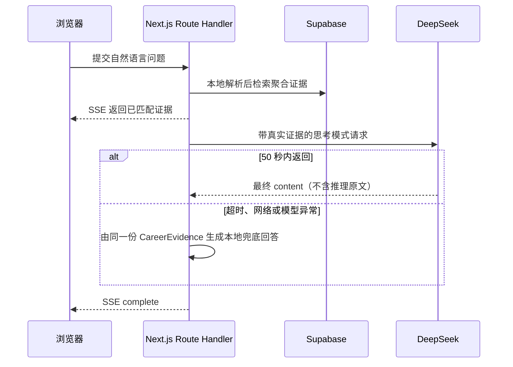

# 深度思考职业建议与零基础课件设计

## 1. 背景与目标

职向量当前使用一次 DeepSeek 非思考模式调用，将 Supabase 检索到的职业证据整理为 260-520 个汉字的短建议。这个方案响应快，但无法满足需要更完整解释、更多决策依据和更清晰学习路径的用户。

本次改动有两个目标：

1. 将最终建议改为由 DeepSeek 在服务端开启思考模式后生成，输出 700-1200 个汉字的完整职业解读；思考过程本身不返回给浏览器、不保存到数据库，也不在页面展示。
2. 新增一组面向零基础读者的 Markdown 课件，讲清从原始招聘数据到网页建议、登录、部署和故障排查的完整过程。

本次不改变数据库表结构、不新增第三方生产依赖、不修改 Supabase 数据，也不改变用户问答、Email OTP 和历史会话的产品交互。

## 2. 已选方案与边界

采用“单次深度思考 + 固定时间预算 + 本地证据兜底”方案。



选择原因：保留当前“仅一次模型调用”和“证据先展示”的低等待感，同时让模型有空间组织复杂的职业分析。两次模型调用会把延迟和失败概率叠加，因此不采用；只扩大非思考模式输出则不能满足用户明确提出的深度思考需求。

### 2.1 时间预算

Vercel 的 `app/api/chat/route.ts` 函数最大持续时间调整为 60 秒。模型并不能占满 60 秒，具体预算如下：

| 阶段 | 上限 | 责任 |
|---|---:|---|
| 本地解析、Supabase 检索、SSE 证据预览 | 正常情况下数秒 | `lib/local-query.ts`、`lib/evidence.ts`、Route Handler |
| DeepSeek 思考并生成最终可见内容 | 50 秒 | `lib/deepseek.ts` |
| 发生异常后的本地兜底、持久化与 SSE 结束 | 预留约 10 秒 | `lib/career-presentation.ts`、Route Handler |

模型阶段通过 `AbortSignal.timeout(50_000)` 主动终止，不能依赖 Vercel 强制终止。这样即使模型慢，用户仍会在一分钟内获得基于真实数据库证据的可用回答。

### 2.2 可见回答与安全边界

DeepSeek 请求显式使用 `thinking: { type: "enabled" }`。前端和数据库只消费 API 返回的 `message.content`；不读取、传输、记录或展示任何 `reasoning_content`。回答仍必须只依据 `CareerEvidence`，并保持以下规则：

- 没有直接观测到的技能组合，不推断组合工资互补效应或组合前景。
- 薪资、趋势、AI 渗透率和城市信息必须来自检索证据；不能补造数字或因果关系。
- 首段给出用户可采取的职业或城市决策；随后解释证据、趋势和技能补强。
- 目标长度为 700-1200 个汉字；代码仍应在句子边界限制超长回答。
- 兜底回答不假装是模型回答，也不会停留在无限加载状态。

### 2.3 可配置项

环境变量保留为唯一的密钥来源。新增非敏感运行时开关，以便在测试或预算变化时切换，而无需改动代码：

```text
DEEPSEEK_ANSWER_MODEL=deepseek-v4-flash
DEEPSEEK_THINKING_MODE=enabled
DEEPSEEK_ANSWER_TIMEOUT_MS=50000
```

`DEEPSEEK_THINKING_MODE` 只允许 `enabled` 或 `disabled`；非法值在服务端启动时给出清晰错误。`DEEPSEEK_ANSWER_TIMEOUT_MS` 使用保守的正整数范围，默认 50000，不能高于 Route Handler 的 60 秒时限。`DEEPSEEK_API_KEY`、Supabase service-role 密钥仍不能出现在任何 `NEXT_PUBLIC_` 变量、客户端代码、Git 提交或文档示例中。

## 3. 代码改动范围

| 文件 | 改动 |
|---|---|
| `lib/env.ts` | 增加并校验思考模式、模型超时配置；保持密钥仅服务端读取。 |
| `lib/deepseek.ts` | 构造思考模式请求，使用 50 秒默认超时，将提示词改为完整解读，并将可见回答上限调整为 1200 字。 |
| `vercel.json` | 将 `/api/chat` 的 `maxDuration` 从 30 调整为 60。 |
| `.env.example` | 补充两个非敏感运行时配置及说明。 |
| `README.md`、`docs/PROJECT_ARCHITECTURE.md` | 更新当前模式、时间预算和原始 9.03 秒非思考基准的历史定位，避免文档与代码矛盾。 |
| 现有 Vitest 测试 | 先补充深度思考 payload、超时边界、1200 字截断和环境变量校验测试，再修改实现。 |

不改动 `supabase/schema.sql`、数据导入脚本、浏览器 Supabase 客户端、认证逻辑或生产环境的密钥值。

## 4. 零基础课件文档

在 `docs/guide/` 新增七篇相互独立、按学习顺序阅读的 Markdown 文档：

| 文件 | 读者完成后应理解的内容 |
|---|---|
| `00-项目是什么.md` | 项目解决什么问题，输入、输出、离线数据与线上查询的边界。 |
| `01-平台与角色.md` | Next.js、TypeScript、Tailwind、Supabase、DeepSeek、Vercel、GitHub 分别负责什么，以及它们如何连接。 |
| `02-数据如何变成职业建议.md` | 800 万招聘明细如何离线聚合、导入 Supabase，再转化为职业、城市、趋势和技能建议。 |
| `03-从零搭建前后端.md` | 如何建立 Next.js 页面、Route Handler、SSE、严格类型和服务端密钥边界。 |
| `04-登录、邮件与安全.md` | Supabase OTP、回调 URL、RLS、Resend SMTP、公开密钥与 service-role 密钥的区别。 |
| `05-部署、域名与环境变量.md` | GitHub 推送、Vercel 自动部署、环境变量、域名、Supabase URL 配置及上线验证。 |
| `06-故障排查与真实踩坑.md` | 缺少环境变量、Vercel 客户端异常、错误回调、邮件限流/SMTP、长响应与模型兜底的症状、原因、排查和修复。 |

每篇文档必须包含：目标、先备知识、核心概念、至少一个与本项目对应的真实路径或代码片段、为什么这样设计、可验证的检查步骤、常见错误与安全提醒。关系复杂处使用 Mermaid 流程图或时序图；不把密钥、真实邮箱、真实 API Key 或可识别个人信息写入文档。

## 5. 测试与验收

实施遵循测试先行：

1. 为 DeepSeek payload 新增断言：默认启用思考模式、超时参数来自经过校验的环境变量、可见输出最大 1200 字并按句末截断。
2. 为环境变量新增断言：允许的开关值、非法开关值、非正数或超过安全上限的超时都能返回清晰错误。
3. 运行 `npm test`、`npm run lint`、`npm run build` 和 `git diff --check`。
4. 本地运行 `npm run dev`，以示例问题验证先收到 SSE 证据，再在模型成功或受控超时时收到最终回答；不使用真实用户邮箱或密钥作为测试输出。
5. 推送后由 Vercel 自动构建；上线验证检查页面可加载、浏览器控制台无异常、问答接口不泄露密钥，并确认 60 秒内产生最终回答或证据兜底。

验收标准是：用户能读懂新增课件；服务端开启思考模式时可获得更完整的回答；模型慢或失败时不会超过一分钟无响应；所有敏感密钥继续留在本地或 Vercel 服务端环境变量中。

## 6. 风险与处理

| 风险 | 处理方式 |
|---|---|
| 深度思考显著增加延迟或成本 | 只保留一次模型调用、限制 50 秒、限制可见内容长度，并保留环境变量开关。 |
| Vercel 函数在模型返回前结束 | 主动设置小于函数上限的模型超时，并通过本地兜底结束 SSE。 |
| 模型暴露内部推理或虚构数据 | 仅读取 `content`，提示词限制证据来源，保持已有的组合证据边界。 |
| 文档与实际实现脱节 | 将 README 与架构文档和代码同一次更新；验收时交叉检查配置名、路径和时间值。 |
| 初学者误将密钥放入客户端或 Git | 每篇涉及配置的课件都区分公开 Supabase key 与仅服务端密钥，并列出 `.env.local`、Vercel Environment Variables 和 Git 忽略规则。 |

## 7. 非目标

本次不实现多模型路由、向量检索、实时岗位抓取、微信登录、原始招聘明细在线查询、数据库迁移或邮件服务商改造。这些是独立工作项，避免使本次可靠性和文档改动扩大为平台重构。
